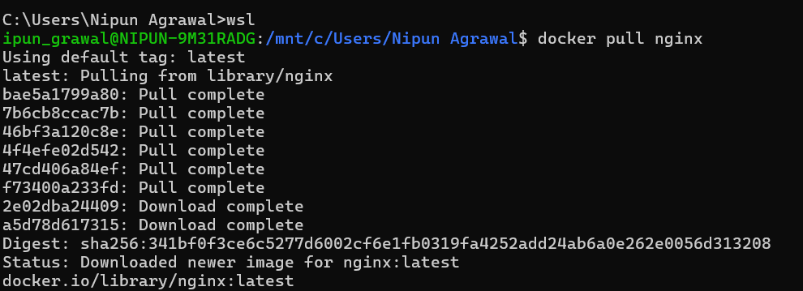
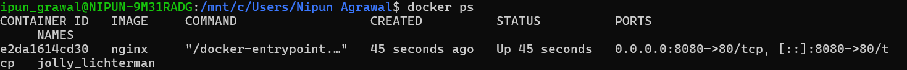

Experiment 2
Docker Installation, Configuration, and Running Images

Name: Nipun Agrawal
Roll No: R2142230048
SAP ID: 500119472
University: UPES Dehradun

### Aim
To install Docker, pull images, run containers, and manage container lifecycle.

### Objectives
Pull Docker images from Docker Hub
Run containers with port mapping
Verify running containers
Manage container lifecycle

### Theory
Docker is a containerization platform that packages applications with dependencies into containers. Containers are lightweight and faster than virtual machines.

A Docker Image is a template. A Docker Container is a running instance of that image.

Software Requirements
Windows OS
Docker Desktop (WSL)
Ubuntu
Procedure

### Step 1: Pull Docker Image
 docker pull nginx
This downloads the Nginx image from Docker Hub.

### Step 2: Run Container
 docker run -d -p 8080:80 nginx
-d → Background mode
-p → Port mapping

### Step 3: Verify Containers
  docker ps

### Step 4: Stop & Remove Container

 docker stop <container_id>  docker rm <container_id>

### Step 5: Remove Image
docker rmi nginx
This deletes the image and frees space.

### Result
Docker images were pulled, containers executed, and lifecycle commands were performed successfully.

### Conclusion
Docker provides a lightweight and efficient environment for application deployment.

Viva Questions
What is a Docker image?
What is a container?
Difference between docker run and docker start?
Why port mapping is used?
Why containers are lightweight?
Overall Conclusion
Containers are faster and efficient for deployment, while VMs provide stronger isolation.