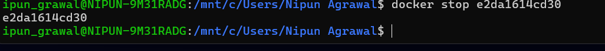

<!DOCTYPE html>
<html>
<head>
    <title>Experiment 2 - Docker</title>

    
</head>

<body>

Home

<h1>Experiment 2</h1>

<b>Docker Installation, Configuration, and Running Images</b>

<b>Name:</b> Nipun Agrawal  
<b>Roll No:</b> R2142230048  
<b>SAP ID:</b> 500119472  
<b>University:</b> UPES Dehradun

<h2>Aim</h2>

To install Docker, pull images, run containers, and manage container lifecycle.

<h2>Objectives</h2>
<ul>
<li>Pull Docker images from Docker Hub</li>
<li>Run containers with port mapping</li>
<li>Verify running containers</li>
<li>Manage container lifecycle</li>
</ul>

<h2>Theory</h2>

Docker is a containerization platform that packages applications with dependencies into containers.
Containers are lightweight and faster than virtual machines.

A <b>Docker Image</b> is a template. A <b>Docker Container</b> is a running instance of that image.

<h2>Software Requirements</h2>
<ul>
<li>Windows OS</li>
<li>Docker Desktop (WSL)</li>
<li>Ubuntu</li>
</ul>

<h2>Procedure</h2>

<h3>Step 1: Pull Docker Image</h3>

<code>docker pull nginx</code>

This downloads the Nginx image from Docker Hub.

<h3>Step 2: Run Container</h3>

<code>docker run -d -p 8080:80 nginx</code>

<b>-d</b> → Background mode  
<b>-p</b> → Port mapping  

<h3>Step 3: Verify Containers</h3>

<code>docker ps</code>

<h3>Step 4: Stop & Remove Container</h3>

<code>docker stop &lt;container_id&gt;</code>

<code>docker rm &lt;container_id&gt;</code>

<h3>Step 5: Remove Image</h3>
<code>docker rmi nginx</code>

This deletes the image and frees space.

<h2>Result</h2>

Docker images were pulled, containers executed, and lifecycle commands were performed successfully.

<h2>Conclusion</h2>

Docker provides a lightweight and efficient environment for application deployment.

<h2>Viva Questions</h2>
<ul>
<li>What is a Docker image?</li>
<li>What is a container?</li>
<li>Difference between docker run and docker start?</li>
<li>Why port mapping is used?</li>
<li>Why containers are lightweight?</li>
</ul>

<h2>Overall Conclusion</h2>

Containers are faster and efficient for deployment, while VMs provide stronger isolation.

</body>
</html>