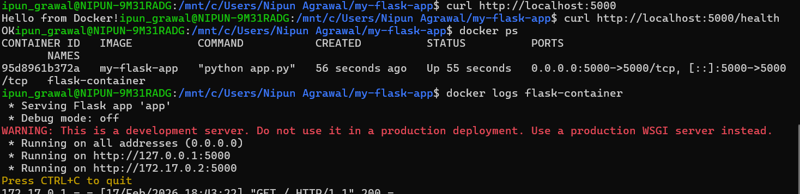
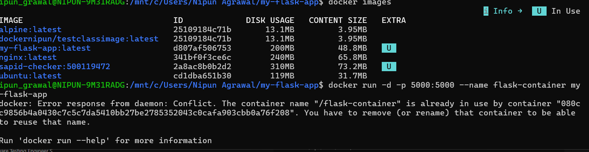
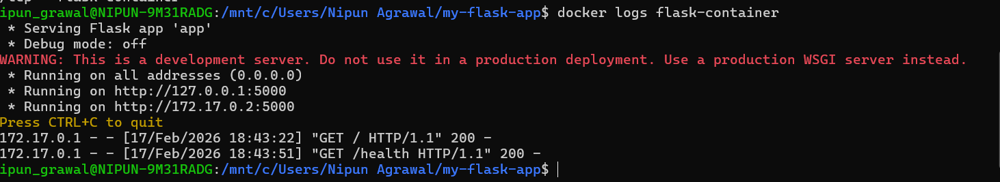
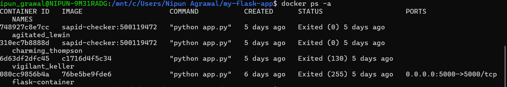
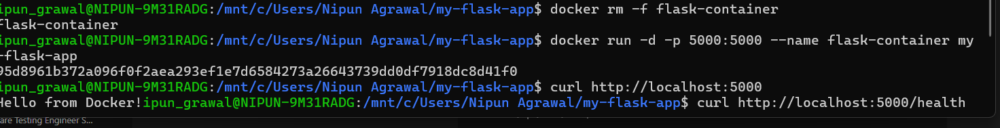
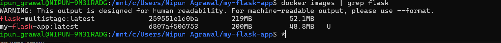
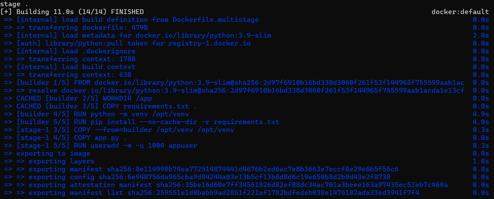
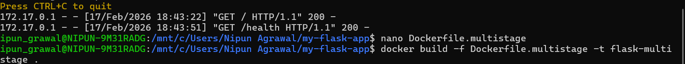

### Experiment 4: Docker Essentials

***Name:***  Nipun Agrawal 

***Roll No***: R2142230048

***SAP ID***: 500119472

***School***: School of Computer Science

***University***: University of Petroleum and Energy Studies, Dehradun

### Part 1: Containerizing Applications with Dockerfile

### Step 1: Create a Simple Application

 Python Flask App

mkdir my-flask-app

cd my-flask-app

app.py
from flask import Flask

app = Flask(__name__)

@app.route('/')
def hello():
    return "Hello from Docker!"

@app.route('/health')
def health():
    return "OK"

if __name__ == '__main__':
    app.run(host='0.0.0.0', port=5000)
requirements.txt
Flask==2.3.3
### Step 2: Create Dockerfile

Dockerfile

# Use Python base image
FROM python:3.9-slim

# Set working directory
WORKDIR /app

# Copy requirements file
COPY requirements.txt .

# Install dependencies
RUN pip install --no-cache-dir -r requirements.txt

# Copy application code
COPY app.py .

# Expose port
EXPOSE 5000

# Run the application
CMD ["python", "app.py"]

### Part 2: Using .dockerignore

### Step 1: Create .dockerignore

__pycache__/
*.pyc
*.pyo
*.pyd

.env
.venv
env/
venv/

.vscode/
.idea/

.git/
.gitignore

.DS_Store
Thumbs.db

*.log
logs/

tests/
test_*.py

 Why .dockerignore is Important

Prevents unnecessary files from being copied

Reduces image size

Improves build speed

Increases security

### Part 3: Building Docker Images

 ### Step 1: Basic Build

docker build -t my-flask-app .

docker images

###  Step 2: Tagging Images

docker build -t my-flask-app:1.0 .

docker build -t my-flask-app:latest -t my-flask-app:1.0 .

docker build -t username/my-flask-app:1.0 .

docker tag my-flask-app:latest my-flask-app:v1.0

###  Step 3: View Image Details

docker images

docker history my-flask-app

docker inspect my-flask-app

###  Part 4: Running Containers

### Step 1: Run Container

docker run -d -p 5000:5000 --name flask-container my-flask-app

curl http://localhost:5000

docker ps

docker logs flask-container

### Step 2: Manage Containers

docker stop flask-container

docker start flask-container

docker rm flask-container

docker rm -f flask-container

 Part 5: Multi-stage Builds

Why Multi-stage Builds?

Smaller final image size

Better security

Separate build & runtime environment

 Multi-stage Dockerfile

Dockerfile.multistage

# STAGE 1: Builder

FROM python:3.9-slim AS builder

WORKDIR /app

COPY requirements.txt .
RUN python -m venv /opt/venv
ENV PATH="/opt/venv/bin:$PATH"
RUN pip install --no-cache-dir -r requirements.txt

# STAGE 2: Runtime

FROM python:3.9-slim

WORKDIR /app

COPY --from=builder /opt/venv /opt/venv
ENV PATH="/opt/venv/bin:$PATH"

COPY app.py .

RUN useradd -m -u 1000 appuser
USER appuser

EXPOSE 5000

CMD ["python", "app.py"]

 Build & Compare
docker build -t flask-regular .
docker build -f Dockerfile.multistage -t flask-multistage .
docker images | grep flask-

Expected:

flask-regular → ~250MB

flask-multistage → ~150MB

### Part 6: Publishing to Docker Hub

 Login & Push
docker login
docker tag my-flask-app:latest username/my-flask-app:1.0
docker push username/my-flask-app:1.0
docker push username/my-flask-app:latest

 Pull & Run
docker pull username/my-flask-app:latest
docker run -d -p 5000:5000 username/my-flask-app:latest

###  Part 7: Node.js Example

###  Step 1: Create App
mkdir my-node-app
cd my-node-app
app.js
const express = require('express');
const app = express();
const port = 3000;

app.get('/', (req, res) => {
    res.send('Hello from Node.js Docker!');
});

app.get('/health', (req, res) => {
    res.json({ status: 'healthy' });
});

app.listen(port, () => {
    console.log(`Server running on port ${port}`);
});
package.json
{
  "name": "node-docker-app",
  "version": "1.0.0",
  "main": "app.js",
  "dependencies": {
    "express": "^4.18.2"
  }
}

 Node.js Dockerfile
FROM node:18-alpine

WORKDIR /app

COPY package*.json ./
RUN npm install --only=production

COPY app.js .

EXPOSE 3000

CMD ["node", "app.js"]

 Build & Run
docker build -t my-node-app .
docker run -d -p 3000:3000 --name node-container my-node-app
curl http://localhost:3000

### Essential Docker Commands 

Command	Purpose	Example

docker build	Build image	docker build -t myapp .
docker run	Run container	docker run -p 3000:3000 myapp
docker ps	List containers	docker ps -a
docker images	List images	docker images
docker tag	Tag image	docker tag myapp:latest myapp:v1
docker push	Push to registry	docker push username/myapp
docker pull	Pull from registry	docker pull username/myapp
docker rm	Remove container	docker rm container-name
docker rmi	Remove image	docker rmi image-name
docker logs	View logs	docker logs container-name
docker exec	Execute command	docker exec -it container-name bash

###  Workflow Summary

Development Workflow
docker build -t myapp .
docker run -p 8080:8080 myapp
docker tag myapp:latest myapp:v1.0
docker push myapp:v1.0
Production Workflow
docker pull myapp:v1.0
docker run -d -p 80:8080 --name prod-app myapp:v1.0
docker logs -f prod-app

### Cleanup Commands

docker container prune
docker image prune
docker system prune -a

###  Key Takeaways

Dockerfile defines how to build images

.dockerignore improves security & performance

Tagging helps version control

Multi-stage builds reduce size

Always test locally before publishing

### Conclusion

This experiment demonstrated:

Building Docker images

Running containers

Multi-stage optimization

Publishing to Docker Hub

Node.js and Python containerization

Docker simplifies application deployment and ensures portability across environments.